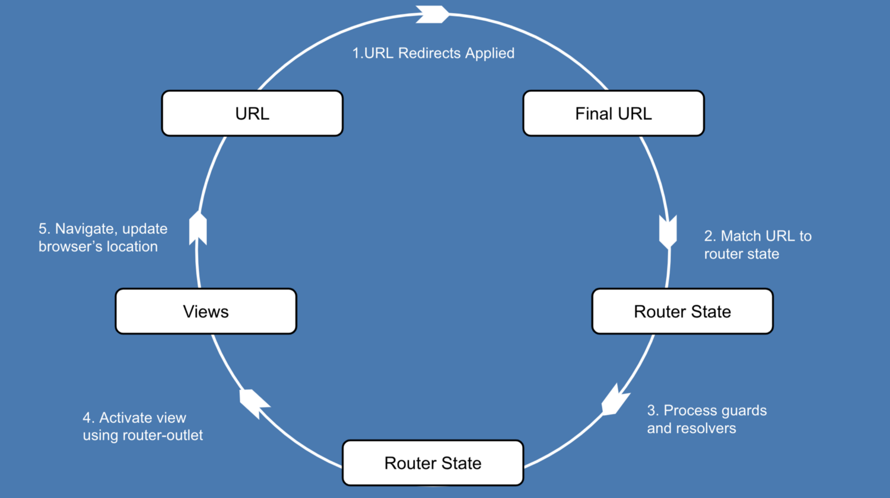

# REACT-SPA-MIDDLEWARE
## INSTALL
`npm i react-spa-middleware`

## MOTIVATION
In react ecosystem I didn't find router with: permission guard, data prefetching and last but not least, readable API for route configuration.
## DESCRIPTION
### It's a middleware for __[router5](https://router5.js.org/)__ library that turn your react app to rich spa and give you:
- data prefetching - between state navigation change.
- your pages(hoc) - lazy.
- nested view.

about another capabilities you can read in documentation for __[router5](https://router5.js.org/#docs)__



## DEPENDENCIES
- __[router5](https://router5.js.org/)__
- __[react-router5](https://www.npmjs.com/package/react-router5)__
- __[router5-plugin-browser](https://www.npmjs.com/package/router5-plugin-browser)__
- __[rxjs](https://rxjs.dev/)__

### Install all
`npm i router5 react-router5 router5-plugin-browser rxjs react-spa-middleware`

## HOW TO USE

__[Full example](./example/)__
### Route config
```typescript
import { AppRoutes } from 'react-spa-middleware';
/**
 * @example home service for data prefetching
 */
import { homeService } from '@services/home/home.service';

export const routes: AppRoutes = [
  {
    name: 'home',
    path: '/',
    component: () => import('@pages/home/home.page'), // lazy loading
    resolve: () => {
	    /**
	     * myData is a props name in home.page.tsx component 
	     */
      return {
        myData: homeService.getList(),
      };
    },
  },
  {
/**
 * @example Nested view for home.page.tsx
 * If first parameter [ / ] in url, no need to add [ / ] for nested view
 * But whan first parameter is relative path like [ /home ] you need add [ /garage ] for nested view
 */

    name: 'home.garage',
    path: 'garage',
    component: () => import('@pages/garage/garage.page'), 
    resolve: () => {
      return {
        data: Promise.resolve('Garage 5x5'),
      };
    },
  },
]
```
### Init router
```typescript
import createRouter from 'router5';
import browserPlugin from 'router5-plugin-browser';
import { routes } from '../routes';
import { reactSpaMiddleware } from 'react-spa-middleware';

export const initRouter = () => {
  const router = createRouter(routes, {
    defaultRoute: '/',
    queryParamsMode: 'loose',
  });
  router.usePlugin(browserPlugin());
  /** 
   * Add middleware - reactSpaMiddleware
   */
  router.useMiddleware(reactSpaMiddleware(routes));

  return router;
};
```
### Attach router
```typescript
import App from './App';
import { RouterProvider } from 'react-router5';
import { initRouter } from './initRouter';

const router = initRouter();

router.start(() =>
  ReactDOM.render(
    <React.StrictMode>
      <RouterProvider router={router}>
          <App />
      </RouterProvider>
    </React.StrictMode>,
    document.getElementById('root')
  )
);
```
### App view 
```typescript
import { MainOutlet } from 'react-spa-middleware';

export function App() {
	return (
		//... 
		/**
		 * You can have only one 
		 * main outlet in your app
		 */
		<MainOutlet />
		//...
	)
}
```
### Nested view - each component that was resolved through routes, will get `Outlet` props
```typescript
import { IOutlet } from 'react-spa-middleware';

const Home: FC<IOutlet> = ({Outlet}) => {
	return <div>
	<p>Home Page</p>
	<Outlet /> // Nested view
	</div>
}
```